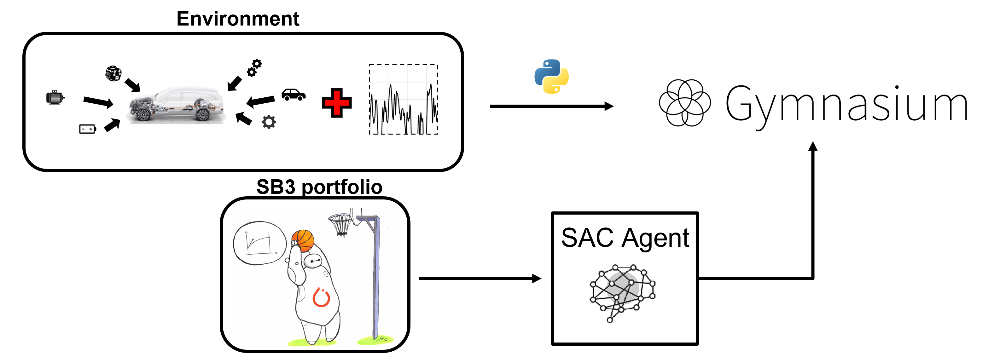
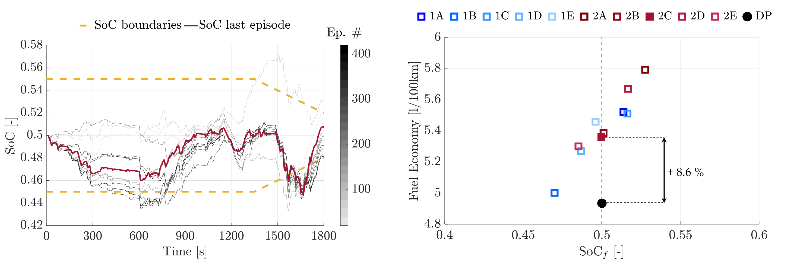

# SAC-for-EMS-Hybrid-Electric-Vehicles
Official implementation of the paper [Development of a Soft-Actor Critic reinforcement Learning Algorithm for the Energy Management of Hybrid Electric Vehicle](https://www.sae.org/publications/technical-papers/content/2024-37-0011/)
presented at CO2 Reduction for Transportation Systems Conference 2024, held in Turin.

</td>  
</td>  

This repository provides the code and methodology for setting up and training a Soft-Actor Critic (SAC) reinforcement learning algorithm to optimize the energy management of a Hybrid Electric Vehicle (HEV). The implementation is built using Python and leverages the OpenAI Gym environment to simulate the HEV system and the Stable Baselines3 library to set the SAC agent.

The repository includes detailed explanations and modular code for:

- HEV backward kinematic model compliant with the OpenAI Gym framework
- SAC algorithm implementation using Stable Baselines3 library
- Training and testing procedures
- Methodology to postprocess the output of the simulation

The code is designed to be modular, allowing for 
- Easy integration of new Stable Baselines3 agents
- Easy customization of the vehicle model environment
- Easy integration of different reward functions

## STAY TUNED!
The code will be available soon!!!!! 🚀
We’re working hard to finalize and share this resource. Check back here for updates!
